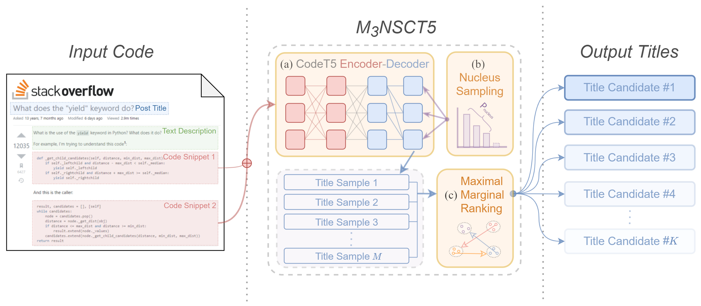

# M3NSCT5
The code base for our paper （submitted to Journal of Systems and Software）
"**[Diverse Title Generation for Stack Overflow Posts with Multiple Sampling Enhanced Transformer](https://arxiv.org/abs/2208.11523)**"

M3NSCT5 is a hybrid method combining the Maximal Marginal Multiple Nucleus Sampling strategy and the CodeT5 model, which is proposed to tackle the ambiguity issue when generating Stack Overflow post titles from code snippets.



### Environment
Before you run the code, make sure you have prepared the necessary environment:
```
conda create -n m3nsct5 python=3.7
conda activate m3nsct5
pip install -r requirements.txt
```

### Dataset and Models

Here is the directory structure of our repository:

```
├─main.py  # entry_point
├─mytrainer.py  # top-p + CodeT5
├─dataset  # the train/val/test data
├─metrics
│   ├─myrouge.py  # wrapper of rouge metric
│   ├─ranking.py  # maximal marginal ranking
│   └─scorer.py  # entry for evaluation
│
└─scripts
    ├─codet5_sample.sbatch  # example reference script
    └─codet5_train.sbatch  # example train script
```

#### Citation
If you find this work inspiring for your research, please cite our paper:
```
@misc{https://doi.org/10.48550/arxiv.2208.11523,
  doi = {10.48550/ARXIV.2208.11523},
  url = {https://arxiv.org/abs/2208.11523},
  author = {Zhang, Fengji and Liu, Jin and Wan, Yao and Yu, Xiao and Liu, Xiao and Keung, Jacky},
  title = {Diverse Title Generation for Stack Overflow Posts with Multiple Sampling Enhanced Transformer},
  publisher = {arXiv},
  year = {2022},
  copyright = {arXiv.org perpetual, non-exclusive license}
}
```